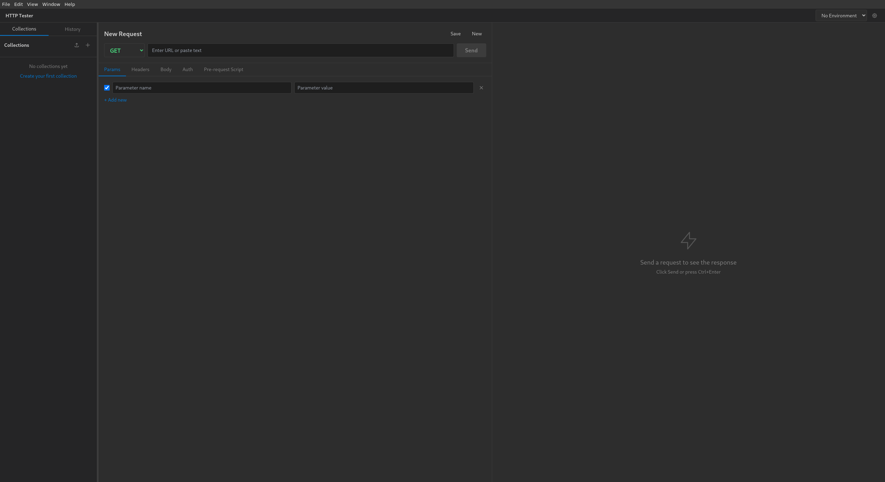

# HTTP Tester

A powerful, open-source desktop application for testing HTTP APIs. Build, send, and analyze HTTP requests with an intuitive interface.



## Features

### Request Builder
- **HTTP Methods** - Support for GET, POST, PUT, PATCH, DELETE, HEAD, and OPTIONS
- **URL Input** - Enter any URL with smart query string parsing
- **Headers Editor** - Add, edit, and toggle custom headers with ease
- **Query Parameters** - Visual editor that syncs with the URL
- **Request Body** - Support for JSON, XML, form-urlencoded, and raw text with syntax highlighting
- **Authentication** - Built-in support for:
  - Basic Authentication
  - Bearer Token
  - API Key (header or query parameter)

### Response Viewer
- **Status Codes** - Color-coded status with human-readable descriptions
- **Response Metrics** - Request duration and response size
- **Headers Tab** - View all response headers in a clean table
- **Body Tab** - Syntax-highlighted response with Pretty/Raw toggle
- **Cookies Tab** - Parsed cookie viewer with all attributes

### Collections
- **Organize Requests** - Group related requests into named collections
- **Descriptions** - Add descriptions to collections and individual requests
- **Import/Export** - Share collections as JSON files with your team
- **Quick Access** - Sidebar navigation for fast request switching

### Environment Variables
- **Multiple Environments** - Create dev, staging, production environments
- **Variable Syntax** - Use `{{variableName}}` anywhere in your requests
- **Quick Switching** - Change environments from the dropdown menu
- **Secure Storage** - Variables stored locally on your machine

### Request History
- **Auto-Save** - Every request automatically logged
- **Quick Restore** - Click any history entry to reload the request
- **Status Tracking** - See status codes and timing at a glance

### Pre-Request Scripts
- **JavaScript Support** - Write scripts that run before each request
- **Environment Access** - Get and set environment variables dynamically
- **Request Modification** - Modify requests programmatically

```javascript
// Example: Add timestamp to requests
pm.environment.set('timestamp', Date.now().toString());
```

## Installation

### Linux (AppImage)
1. Download the latest `.AppImage` from [Releases](https://github.com/jonnyirwin/http-tester/releases)
2. Make it executable: `chmod +x HTTP-Tester-*.AppImage`
3. Run: `./HTTP-Tester-*.AppImage`

> **Note:** AppImage requires FUSE. Install with `sudo apt install libfuse2` if needed.

### Windows (Portable)
1. Download the latest `.exe` from [Releases](https://github.com/jonnyirwin/http-tester/releases)
2. Run the executable - no installation required

### macOS
1. Download the latest `.dmg` from [Releases](https://github.com/jonnyirwin/http-tester/releases)
2. Open the DMG and drag to Applications

## Usage

### Sending Your First Request
1. Select an HTTP method from the dropdown (GET, POST, etc.)
2. Enter the URL in the address bar
3. Click **Send** or press `Ctrl+Enter`
4. View the response in the right panel

### Using Environment Variables
1. Click the gear icon next to the environment dropdown
2. Create a new environment (e.g., "Development")
3. Add variables like `baseUrl` = `https://api.example.com`
4. Use `{{baseUrl}}/users` in your requests

### Saving to Collections
1. Build your request
2. Click **Save**
3. Enter a name and description
4. Select or create a collection
5. Access saved requests from the sidebar

### Sharing Collections
1. Right-click a collection in the sidebar
2. Click the export icon
3. Save the JSON file
4. Share with teammates who can import it

## Keyboard Shortcuts

| Action | Shortcut |
|--------|----------|
| Send Request | `Ctrl+Enter` |
| New Request | Click "New" button |
| Save Request | Click "Save" button |

## Development

### Prerequisites
- Node.js 18+
- npm

### Setup
```bash
git clone https://github.com/jonnyirwin/http-tester.git
cd http-tester
npm install
```

### Run in Development
```bash
npm run dev
```

### Build for Production
```bash
npm run build
```

Build outputs are placed in the `release/` directory.

## Tech Stack

- **Electron** - Cross-platform desktop framework
- **React** - UI components
- **TypeScript** - Type safety
- **Tailwind CSS** - Styling
- **CodeMirror** - Syntax highlighting
- **Zustand** - State management
- **electron-store** - Persistent storage

## Collection Format

Collections are stored as JSON and can be easily shared:

```json
{
  "name": "My API",
  "description": "API endpoints for my project",
  "requests": [
    {
      "name": "Get Users",
      "method": "GET",
      "url": "{{baseUrl}}/users",
      "headers": [],
      "queryParams": [],
      "body": "",
      "auth": { "type": "bearer", "token": "{{apiToken}}" }
    }
  ]
}
```

## Contributing

Contributions are welcome! Please feel free to submit a Pull Request.

## License

MIT License - see [LICENSE](LICENSE) for details.

## Acknowledgments

Built with [Claude Code](https://claude.ai/code)
